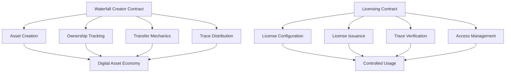

# Streamlined Trace Waterfall

A decentralized platform for tracing, tracking, and licensing digital assets with advanced governance and provenance features on the Stacks blockchain.

## Overview

Streamlined Trace Waterfall enables digital asset managers to:
- Issue and track unique digital traces
- Create multi-tier licensing models
- Manage complex provenance and ownership chains
- Enable secure, auditable asset transfers
- Implement granular access control

Users can:
- Create and manage digital asset traces
- Configure flexible licensing models
- Track asset history and ownership
- Verify authenticity and origin
- Implement custom governance rules

## Architecture

The platform consists of two core smart contracts handling traceability and licensing:



## Contract Documentation

### Waterfall Creator (`waterfall-creator.clar`)

The core contract manages fundamental trace and ownership functionality:

- Digital asset creation and tracking
- Transfer and ownership mechanics
- Trace distribution
- Metadata management

Key features:
- Configurable trace percentages
- Decentralized asset governance
- Immutable trace recording
- Multi-party permission systems

### Licensing (`waterfall-licensing.clar`)

Handles advanced licensing and usage rights:

- Flexible licensing tiers
- Dynamic pricing models
- Comprehensive verification system
- Usage tracking and auditing

## Getting Started

### Prerequisites
- Clarinet
- Stacks wallet
- STX tokens for transactions

### Basic Usage

1. Creating a digital trace:
```clarity
(contract-call? .waterfall-creator create-trace "metadata-uri" u100)
```

2. Transferring a trace:
```clarity
(contract-call? .waterfall-creator transfer-trace trace-id recipient)
```

3. Configuring a license:
```clarity
(contract-call? .waterfall-licensing configure-license-tier trace-id token-id tier price duration max-licenses)
```

## Function Reference

### Creator Contract Functions

#### Trace Management
```clarity
(create-trace (metadata-uri (string-utf8 256)) (trace-percentage uint))
(update-trace-metadata (trace-id uint) (new-metadata-uri (string-utf8 256)))
(freeze-trace-metadata (trace-id uint))
```

#### Transfer Mechanics
```clarity
(transfer-trace (trace-id uint) (recipient principal))
(propose-transfer (trace-id uint) (proposed-recipient principal))
(confirm-transfer (trace-id uint))
```

### Licensing Functions

#### License Management
```clarity
(configure-license-tier (trace-id uint) (token-id uint) (tier uint) (price uint) (duration uint) (max-licenses (optional uint)))
(purchase-license (trace-id uint) (token-id uint) (tier uint))
(renew-license (trace-id uint) (token-id uint) (tier uint))
(revoke-license (trace-id uint) (token-id uint) (tier uint) (licensee principal))
```

## Development

### Testing
Run tests using Clarinet:
```bash
clarinet test
```

### Local Development
1. Start local chain:
```bash
clarinet integrate
```

2. Deploy contracts:
```bash
clarinet deploy
```

## Security Considerations

### Core Contract
- Royalty calculations use basis points to avoid floating-point issues
- Ownership checks prevent unauthorized transfers
- Metadata freezing prevents post-sale modifications

### Licensing Contract
- License validation prevents unauthorized usage
- Expiration tracking ensures proper access control
- Creator-only license configuration and revocation
- Maximum license count enforcement

### General
- All financial transactions verify sufficient funds
- Access control checks on privileged operations
- State changes are atomic and consistent